# SaboViz Usage Guide

Welcome to the SaboViz Usage Guide. This document will walk you through the core functionalities of the tool, from uploading your initial data to interacting with the recovered architectural graphs.

## 1. The Dashboard: Project Management & Analysis

The Dashboard is your control center. Here, you can upload data, manage projects, and trigger architectural analyses.

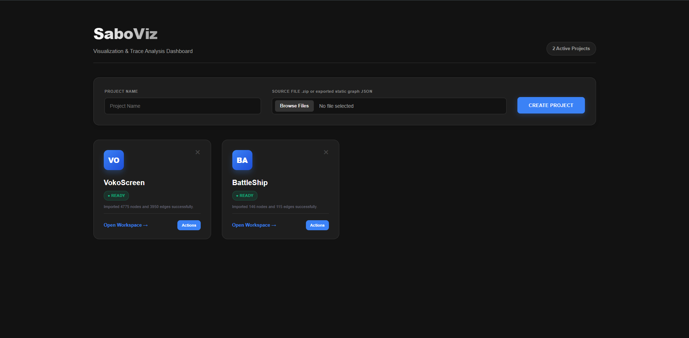
*(Image: The main SaboViz dashboard showing active projects and action buttons.)*

### Creating a Project
To start a new analysis, navigate to the Dashboard and follow these steps:
1. Enter a **Name** for your project.
2. Upload your prepared **`.zip` source file** into the designated upload field.
3. Click the **Create Project** button.

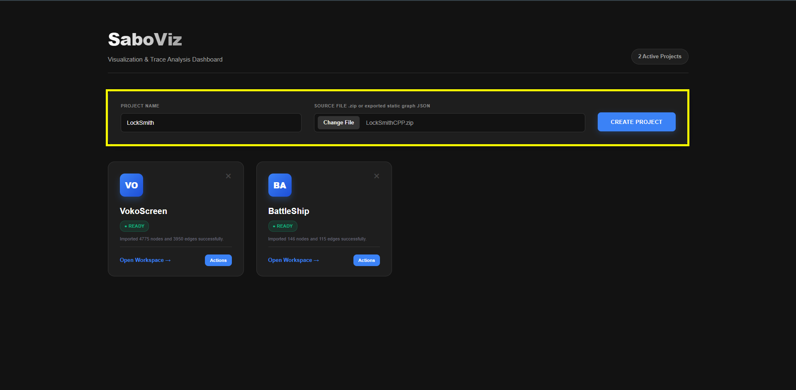
*(Image: The project creation area showing the name input and file upload field.)*

Upon clicking **Create Project**, a configuration modal will appear. This modal allows you to customize how SaboViz handles the ingestion process:

* **Auto-continue when includes are unresolved:** If the parser detects missing external dependencies (like standard C++ libraries or custom headers not included in your zip), checking this box tells SaboViz to ignore the errors and automatically proceed with these unresolved dependencies. If left unchecked, the project will pause in an "Action Needed" state for your review.
* **Run AI summarization after ingestion:** Checking this box will automatically trigger the integrated LLM to generate high-level semantic summaries of your modules as soon as the static parsing is complete.

Select your preferred configuration and confirm to begin parsing.

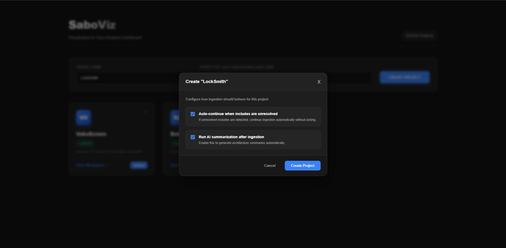
*(Image: The configuration modal showing the "Auto-continue" and "Run AI summarization" checkboxes.)*

### Handling "Action Needed" Status
if you choose *not* to auto-continue and the parser cannot locate specific libraries defined in your `#include` directives, the project status will flag as **Action Needed**.

* Click the **View Details** to investigate the missing headers.
* **Resolution 1 (Fix):** Delete the project, update your `.env` file to include the mising paths in `EXTERNAL_LIBS_PATHS`, restart the tool, and re-upload.
* **Resolution 2 (Ignore):** Click **Process Anyway** to ignore the missing external dependencies and force the tool to proceed with the existing source code. *Note: If the missing files are standard external dependencies, the tool will work just fine and will be able to parse the code correctly.*
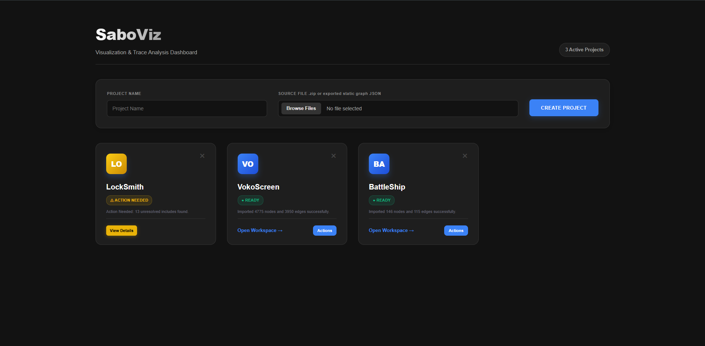
*(Image: Displaying the **Action Needed Status** of the project and the **View Details** button.)*

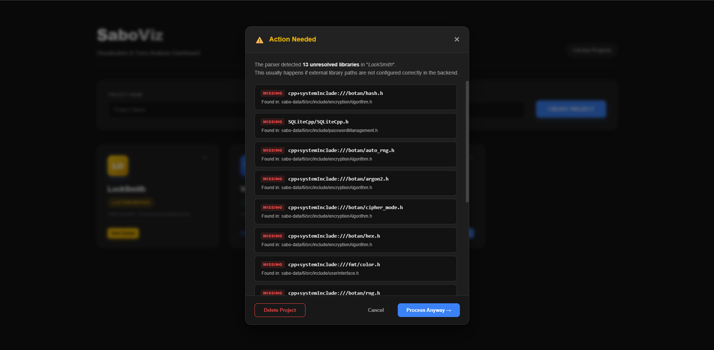
*(Image: The Action Needed modal listing missing C++ header files.)*

### Project Actions & Analysis
Once your static project is ready, you can manage your dynamic data and trigger analyses by clicking the **Actions** button on your project card. This opens the **Project Actions** modal, which serves as your central menu for the following functionalities:

* **Add New Trace:** Upload an additional execution trace file (`.log`) for this project to merge runtime behavior with your static graph.
* **View All Traces:** Open the full trace list to inspect, manage, or delete traces that have already been uploaded.
* **Extract Features:** Starts the functional decomposition process. You can set custom thresholds to cluster entities based on their runtime interactions, automatically identifying high-level system features.
* **Trace Decomposition:** Splits raw, chronological traces into distinct micro-features and coherent execution flow segments to make them readable.
* **Run Summarization:** Generates AI summaries for the entire graph (useful if you did not enable auto-summarization during project creation).
* **Export Static Graph:** Downloads the currently mapped nodes and edges as a file. This allows you to re-import the project later without needing to re-parse the heavy source code files.

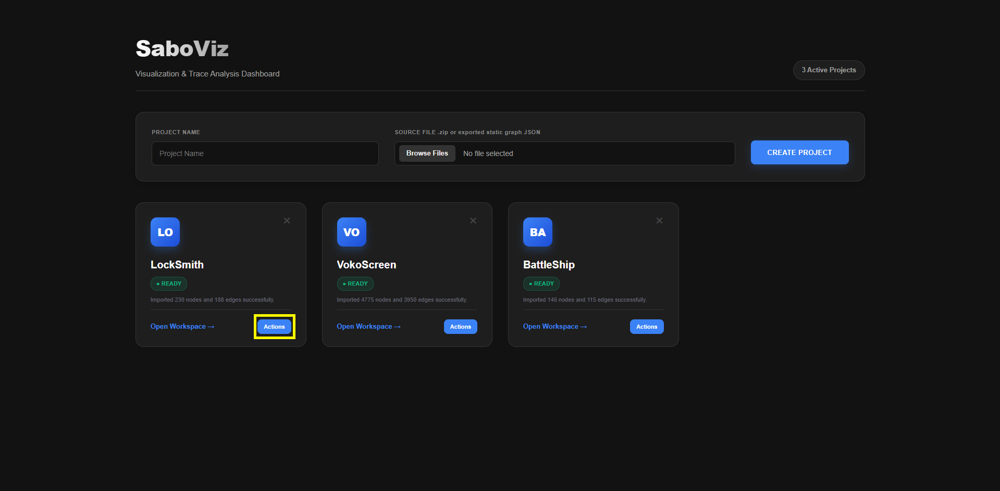
*(Image: Pointing out the Actions button on the project card.)*

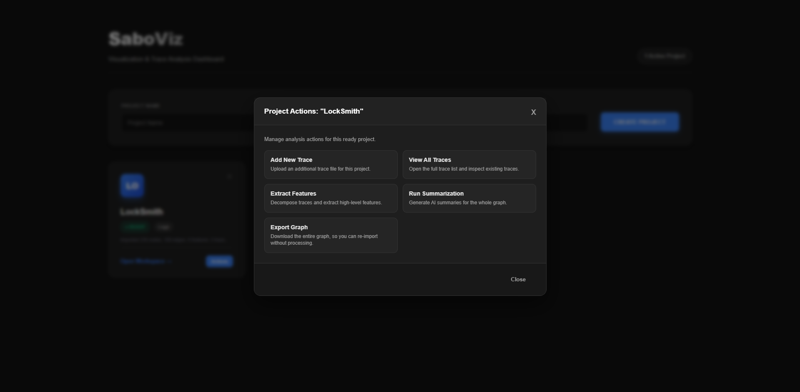
*(Image: The Project Actions modal showing the list of available management and analysis options.)*

### Adding Execution Traces
To merge dynamic runtime behavior with your structural code, you must add your generated execution traces.
1. Click the **Actions** button on your project and select **Add New Trace**.
2. A modal titled **Add Trace to "[Your Project Name]"** will appear.
3. Click the designated upload area (or drag and drop) to select one or more `.log` files containing your execution traces.
4. Click **Upload Trace(s)**. SaboViz will parse the logs and append the dynamic events to your existing knowledge graph.

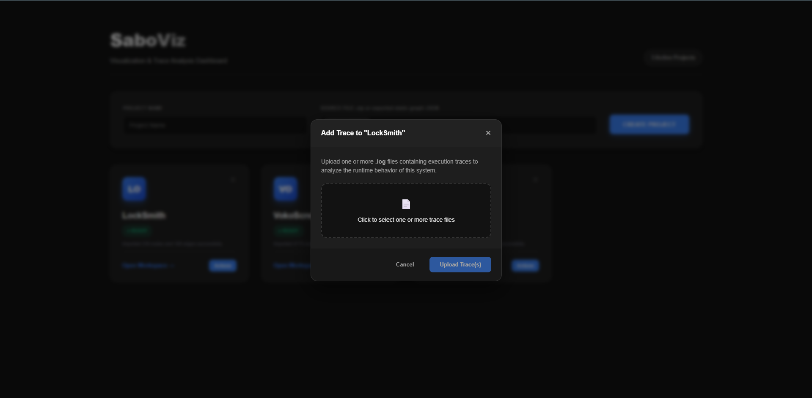
*(Image: The Add Trace modal showing the drag-and-drop file upload area and action buttons.)*

### Managing Traces (View All Traces)
To inspect or delete the execution traces you have uploaded to a project, open the Project Actions modal and click **View All Traces**. This will open a modal listing all dynamic scenarios currently mapped to your architecture.

For each trace, SaboViz provides a detailed breakdown of how successfully the dynamic events were mapped to your static C++ source code:

| Metric | Description |
| :--- | :--- |
| **Steps** | The total number of execution events (function calls and returns) parsed from the `.log` file. |
| **Resolved** | The number of events that successfully and uniquely matched a static entity (e.g., a specific method in a specific class) within your parsed code. |
| **Ambiguous** | The number of events that matched multiple static entities. This usually happens with overloaded functions if the trace logs lacked sufficient scope qualifiers (`Namespace::Class::Method`). |
| **Unresolved** | The number of events that could not be mapped to any static entity in your project (often caused by unparsed external library calls or missing source code files). |

> **💡 Tip: Deleting a Trace**
> If you notice a trace has a high number of unresolved steps, or if you simply want to remove a scenario from the current architecture analysis, click the **`×`** icon next to the specific trace to delete it.

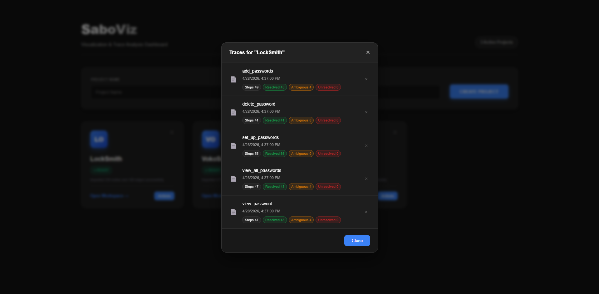
*(Image: The View All Traces modal showing the list of uploaded traces and their mapping statistics.)*

### Extracting Features (Functional Decomposition)
To identify the high-level system features based on your uploaded execution traces, open the Project Actions modal and click **Extract Features**. 

This process uses a hierarchical agglomerative clustering algorithm to group software entities that frequently interact at runtime. When you start the extraction, you will be prompted to configure the following parameters:

| Parameter | Description |
| :--- | :--- |
| **Distance Threshold** *(e.g., 0.4)* | Controls the granularity of the clusters. A lower value requires entities to be highly coupled to form a feature (resulting in smaller, highly specific features). A higher value allows looser coupling (resulting in larger, broader features). |
| **Infrastructure Threshold** *(e.g., 0.3)* | Helps isolate utility or infrastructure components (e.g., generic database drivers, logging modules) that are called globally across multiple features. Properly setting this prevents generic utility classes from being improperly merged into specific business-logic features. |
| **Use AI for Feature Naming** | When enabled, SaboViz passes the clustered entities to the integrated LLM. Instead of generic names like "Feature 1", the AI automatically generates meaningful, human-readable names and descriptions for each discovered feature. |

Select your desired thresholds and click **Start Extraction** to begin the functional decomposition process.

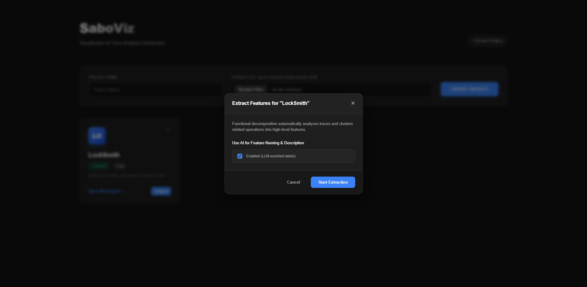
*(Image: The Extract Features configuration modal showing the distance threshold, infrastructure threshold, and AI naming toggle.)*

### Trace Decomposition (Micro-Feature Segmentation)
To break down long, complex execution traces into readable, logical segments (micro-features), open the Project Actions modal and click **Trace Decomposition**. 

This process analyzes the sequence of dynamic events and automatically detects boundaries between different sub-phases of a trace. When you start the decomposition, you will be prompted to configure the following parameters:

| Parameter | Description |
| :--- | :--- |
| **PELT Penalty** *(e.g., 30.0)* | Controls the sensitivity of the changepoint detection algorithm (Pruned Exact Linear Time). A higher penalty makes the algorithm stricter, resulting in fewer, larger execution segments. A lower penalty makes it more sensitive, resulting in many smaller, granular micro-features. |
| **Hierarchical Distance Threshold** *(e.g., 0.50)* | Determines how segmented execution blocks are grouped. A lower threshold requires segments to be highly structurally similar to be clustered into the same micro-feature category. |
| **Use AI for Micro-feature Naming** | When enabled, SaboViz passes the segmented execution blocks to the LLM to generate context-aware, human-readable phase names. When disabled, the system relies strictly on fast, rule-based labeling. |

Select your desired parameters and click **Start Trace Decomposition** to process all uploaded traces for the current project.

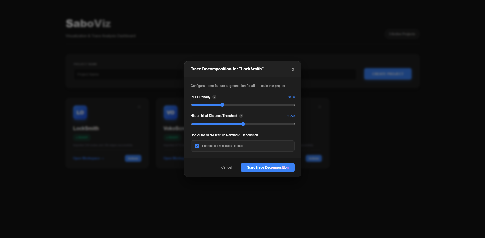
*(Image: The Trace Decomposition configuration modal showing the PELT penalty, distance threshold, and AI naming toggle.)*

## 2. The Graph Page: Architecture Visualization

After running your decompositions, click on the project card to enter the interactive Architecture Visualization dashboard. This is where the hybrid data comes to life.

*(Image: A wide shot of the interactive node graph and side panels.)*

### Interacting with the Architecture
The graph is fully interactive, allowing you to explore the architecture at varying levels of detail:

* **Expand a Node:** Double-click on a parent node (like a File or a Class) to expand it and reveal its internal structure (its children, such as internal Methods or nested Classes).
* **Collapse a Node:** Double-click an expanded node again to collapse it, hiding its children and simplifying your view.
* **Reposition Nodes:** Click and drag any node to move it around the canvas. This allows you to manually organize the graph layout to better suit your comprehension needs.

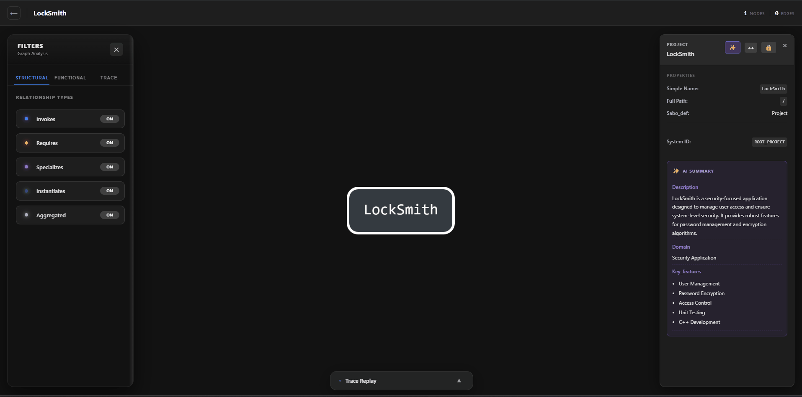
*(Gif: Demonstrating how to double-click to expand/collapse a node and drag to reposition it.)*

### Structural Filters (Edge Visibility)
On the left side of the Graph Page, you will find the **Sidebar Panel**. Under the **STRUCTURAL** tab, you can control the visual complexity of the architecture by toggling different types of relationship edges **ON** or **OFF**. 

This allows you to declutter large graphs and focus purely on the specific architectural perspectives you care about at that moment.

| Edge Type | What it Represents |
| :--- | :--- |
| **Invokes** | Static method-to-method calls or function invocations (*Operation → Operation*). |
| **Requires** | File-level dependencies, such as `#include` directives (*File → File*). |
| **Specializes** | Object-oriented inheritance hierarchies, where a derived class specializes a base class (*Type → Type*). |
| **Instantiates** | Indicates when a specific method or function creates an object instance of a class (*Operation → Type*). |
| **Aggregated Edges** | **Important:** When you collapse a parent node, the dependencies of its hidden children are "rolled up" to the parent level. Aggregated edges represent these hidden dependencies. For example, if a hidden method inside *Class A* invokes a method in *Class B*, an aggregated edge will be drawn directly connecting *Class A* to *Class B*. |

To hide or show a specific relationship type, simply click its corresponding toggle switch in the sidebar. The graph will instantly redraw to reflect your active filters.

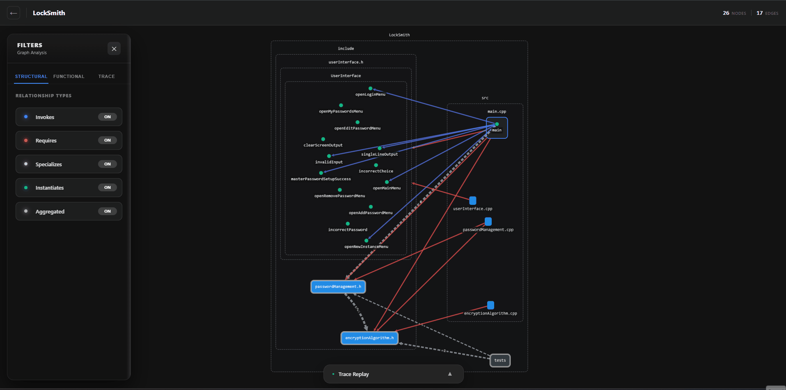
*(Gif: Demonstrating how toggling structural filters immediately hides or shows the corresponding edges on the architecture graph.)*

### Inspecting Entities (The Details Panel)
To deeply understand specific parts of your architecture, you can click on any node or edge to open the **Details Panel** on the right side of the screen. The information displayed adapts based on the type of entity you select.

#### 1. Node Details
Clicking a standard software entity (like a File, Class, or Method) will display its complete architectural context. The panel is divided into the following sections:

* **Header:** Displays the node's simple name and its entity type.
* **Properties:** Lists technical metadata extracted during parsing. 
* **Participating Features:** If you have run Functional Decomposition, this section lists all the high-level system features (or infrastructure groups) that this specific node contributes to at runtime.
* **System ID:** The unique internal identifier used by SaboViz to track the entity.
* **AI Summary:** If you enabled AI summarization, this section displays a human-readable, semantic explanation of what the node does and what its responsibilities are within the broader system.

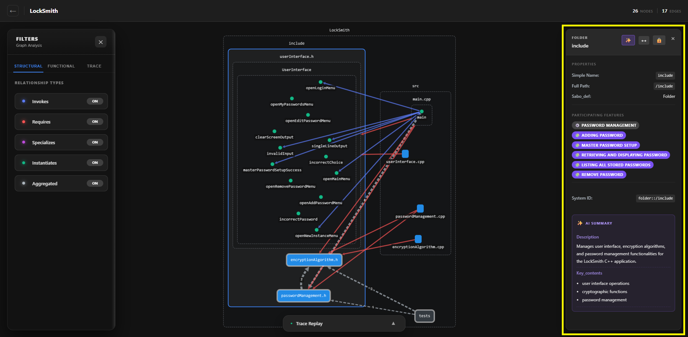
*(Image: The Details Panel showing the properties, participating features, and AI summary of the `include` folder.)*

#### 2. Regular Edge Details
Clicking a standard relationship line will display the direct connection between two structural entities. The panel focuses purely on how these two entities interact:

* **Header:** Displays the specific relationship type (e.g., "Invokes", "Requires").
* **Connections:** Shows the explicit **Source** node (where the interaction originates) and the **Target** node (the receiver of the interaction). The full path or signature of each node is provided for clarity.
* **System ID:** The unique internal identifier used by SaboViz to track this specific relationship.

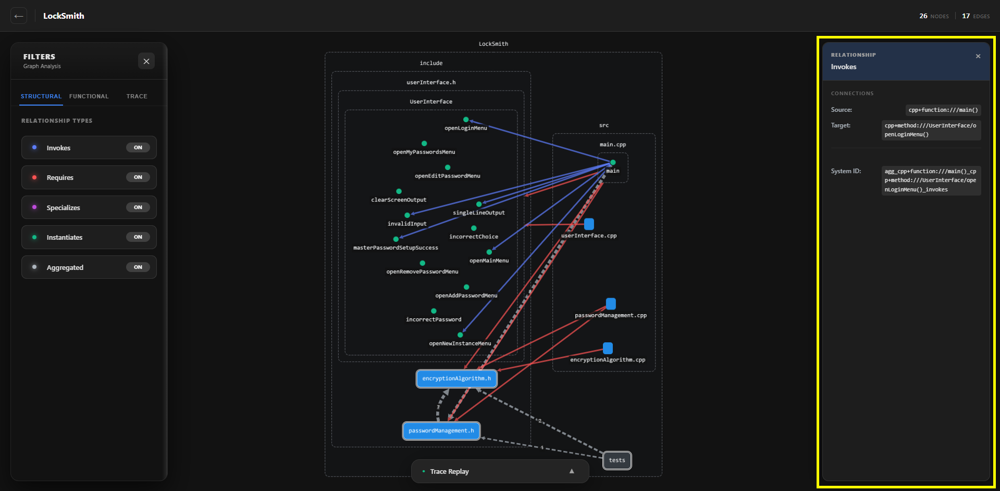
*(Image: The Details Panel showing the source and target connection of a regular 'Invokes' edge.)*

#### 3. Aggregated Edge Details
When parent nodes (like folders or classes) are collapsed, the dependencies of their hidden children are "rolled up" into a single aggregated edge. Clicking this edge reveals the underlying complexity:

* **Header:** Displays the "Aggregate Group" badge and the total number of hidden connections it represents (e.g., "Connections (21)").
* **Connections:** Shows the high-level **Source** and **Target** parent nodes (e.g., `folder::/src` to `folder::/include`) that encompass these hidden dependencies.
* **Edge Composition:** Provides a precise breakdown of the specific relationship types hidden within this single line. For example, it will tell you exactly how many of those 21 connections are "Invokes" versus "Requires".
* **System ID:** The unique internal identifier used by SaboViz to track this aggregated group.

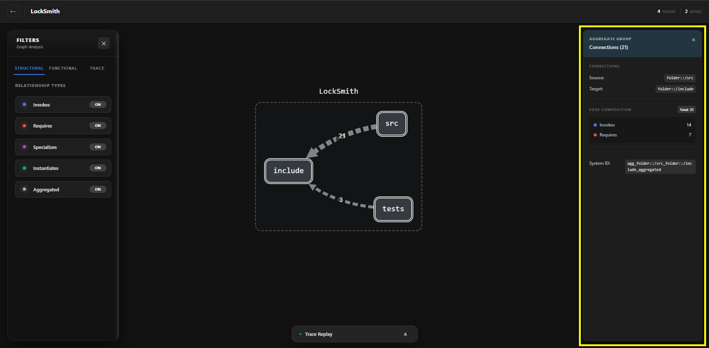
*(Image: The Details Panel showing the source, target, and edge composition breakdown of an aggregated edge.)*

#### 4. AI Node Summarization
At the top of the Node Details panel, you will find a **Summarize** button (✨). Clicking this button triggers the integrated LLM to generate a custom, semantic explanation of that specific entity on demand.

**How it works:** SaboViz does not just look at the node in isolation. The AI summarization dynamically analyzes the selected node **and all of its underlying dependencies (lower nodes)**. Because a software component's true purpose relies heavily on what it interacts with, this deep analysis ensures the generated summary accurately reflects the node's real-world responsibilities and context within the system.

Once generated, the explanation will be saved and displayed at the bottom of the Details Panel under the **AI Summary** section.

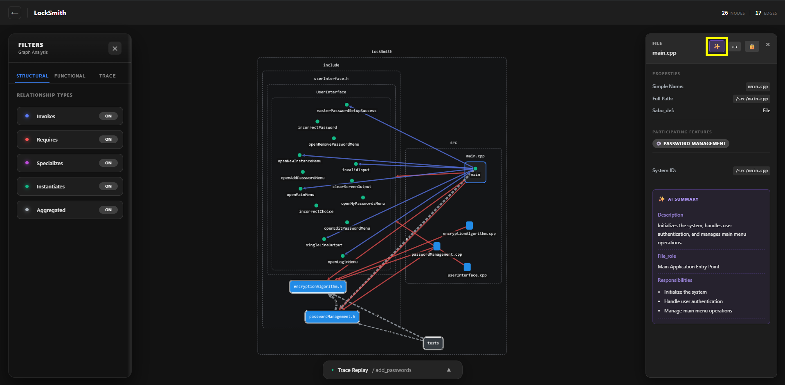
*(Image: Pointing out the Summarize button (✨) at the top of the panel and the resulting AI Summary at the bottom.)*

#### 5. Edge Focus (Isolating Connections)
In highly complex and dense architectures, it can be difficult to trace exactly what a single class or file is interacting with. 

To solve this, open a node's details and click the **Focus Edges (↔)** button located at the top right of the panel. 

**What it does:** Activating this feature instantly **hides** all unrelated edges from the canvas, leaving only the *incoming* (who depends on it) and *outgoing* (what it depends on) connections visible of the selected node. 

**To disable Edge Focus:** You can either click the **(↔)** button in the details panel again, or click the **✕** on the `Edge Focus` badge.

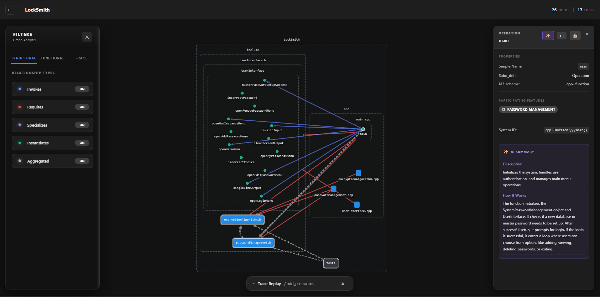
*(Gif: Demonstrating how clicking the Edge Focus button works for the `main` operation.)*

#### 6. Locking Nodes (Focused View)
When a graph becomes dense, you can lock one or more nodes to focus on their local neighborhood.

* Open a node's Details Panel and click the **🔒 Lock** button in the header.
* You can lock multiple nodes to compare their scopes at once.
* While focused, the canvas shows only the locked nodes, their descendants, and the connections between them.
* A **🔒 Focused** badge appears in the top bar. Click the **✕** on the badge or unlock the node in the Details Panel to exit focus mode.

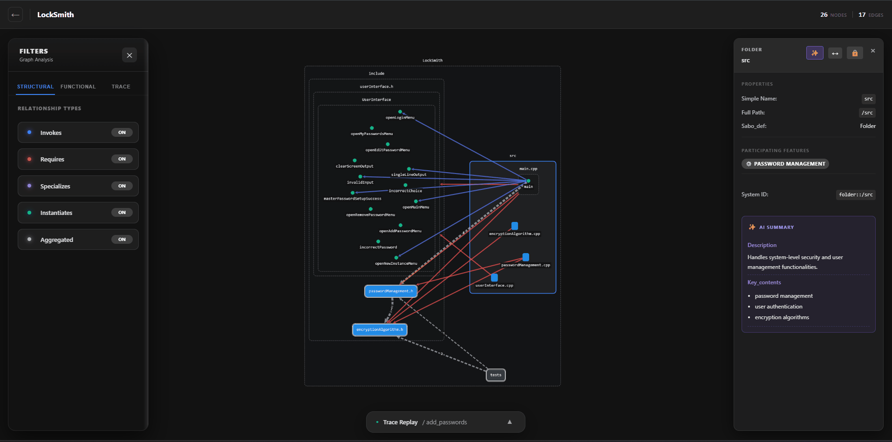
*(Gif: Demonstrating locking a node, seeing the focused view, and clicking the top bar badge to exit.)*

#### 7. Aggregated Nodes (Focus Buckets)
When a focused view is active (lock mode, feature focus, or trace focus), SaboViz groups the out-of-scope nodes into **Aggregated Nodes** to keep the view readable.

* **What they are:** Placeholders that represent a bucket of hidden nodes, shown as a single node labeled with a count (e.g., *aggregated (12)*).
* **Why they appear:** To preserve context without flooding the canvas with unrelated entities.
* **How to expand them:** Open the Aggregated node's Details Panel to reveal individual members or show their dependencies back into the focused scope.
* **Edges:** Aggregated nodes do not automatically draw every hidden connection. Instead, you can selectively reveal edges per member from the Details Panel.

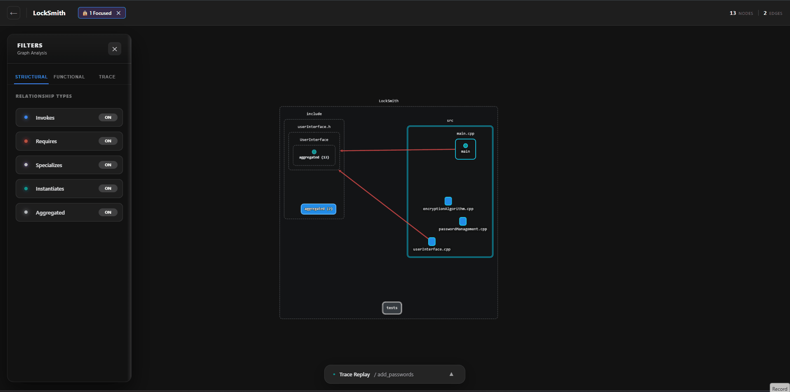
*(Gif: Demonstrating clicking an Aggregated node and using the Details Panel to selectively reveal members or their specific dependency edges.)*

### Trace Replay (Dynamic Behavior)
The **Trace Replay** panel allows you to step through your uploaded execution logs chronologically, animating the exact runtime flow of your system directly on top of the static architecture graph.

#### Selecting & Playing a Trace
To begin, select an uploaded trace from the dropdown in the Trace Replay panel. You can use the playback controls to step forward, step backward, or auto-play through the execution events. 

**Dynamic Aggregation:** Trace steps represent the lowest-level operations (e.g., specific method calls). However, SaboViz is smart enough to respect your current graph layout. If a specific method is hidden inside a collapsed parent, the execution step will automatically visually trigger on the visible ancestor instead, ensuring you never lose track of the flow.

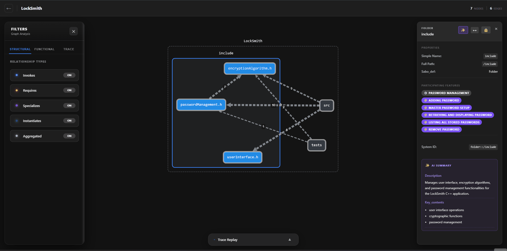
*(Gif: Demonstrating selecting a trace and stepping through the execution.)*

#### Trace Execution Details (Dynamic Edges)
When you are replaying a trace, SaboViz animates the execution flow by drawing temporary "ghost edges" over the graph. Clicking one of these active trace edges reveals its specific runtime context:

* **Header:** Displays the "TRACE EXECUTION" badge and the specific operation happening at that moment (e.g., `30: call addPassword`).
* **Connections:** Shows the exact **Source** component that initiated the step and the **Target** component that received it.
* **Properties:** Provides the exact runtime telemetry for this single execution step. This includes the step number, action type (e.g., `call`, `return`), parameters passed, logged messages, and a precise timestamp.
* **System ID:** The internal identifier for these dynamic lines (typically `trace-ghost-edge`).

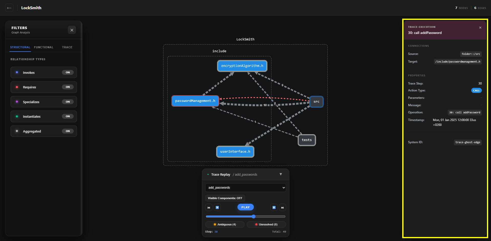
*(Image: The Details Panel showing the execution properties and timestamp of a clicked trace edge.)*

#### Trace Resolution Status
Not all execution logs map perfectly to static code. You can filter and inspect problematic steps using the resolution status features:

* **Ambiguous (Yellow):** The step matched multiple static entities (usually due to overloaded functions missing namespace qualifiers in the logs).
* **Unresolved (Red):** The step could not be mapped to any parsed entity (often external library calls). 

To locate these mapping issues, click the **Ambiguous** or **Unresolved** buttons to reveal exactly where these problematic steps occur on the progress bar. You can then click directly on these colored indicators on the bar to instantly jump to that specific execution step and inspect its details.

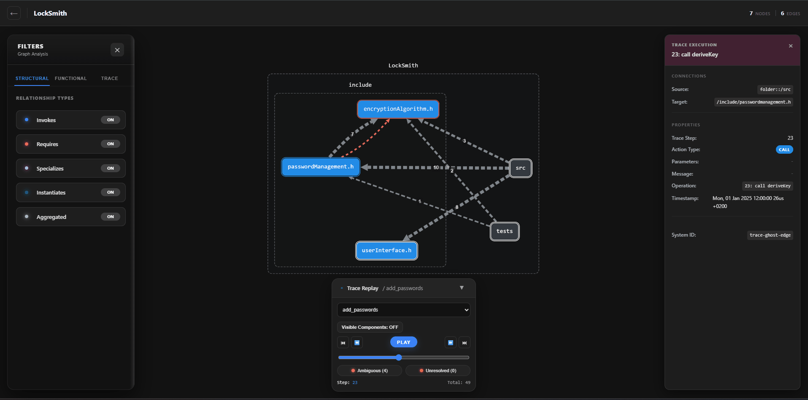
*(Gif: Demonstrating clicking the Ambiguous button to reveal yellow indicators on the progress bar, and then clicking an indicator to jump to that specific step.)*

#### Contextual Step Filtering
The Trace Replay panel works seamlessly with the **Lock (Focused View)** feature to help you debug specific areas of your system. 

If you lock a node (or a set of nodes) to enter a Focused View, the Trace Replay panel will automatically filter its timeline. Instead of showing all 10,000 steps of a massive trace, it will only display the specific execution steps that interact with your currently visible, locked components. 

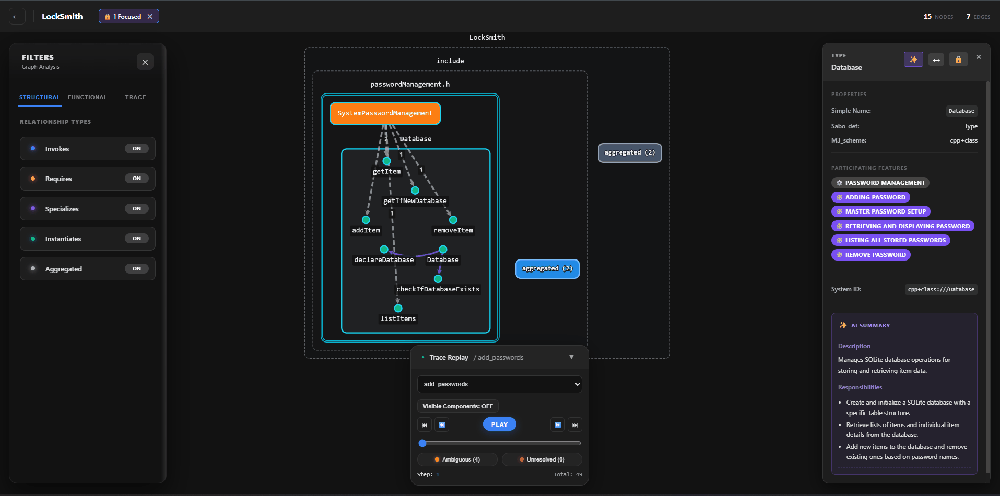
*(Gif: Demonstrating a trace timeline shrinking to just a few relevant steps after a specific node is locked on the canvas.)*

#### Workspace Management (Draggable UI)
Because the architecture graph can get dense, the Trace Replay panel is fully draggable. 

Click and drag the panel by its header to move it around the screen. You can conveniently dock it below the left Sidebar Panel or the right Details Panel to ensure it never obfuscates the critical parts of the graph you are trying to analyze.

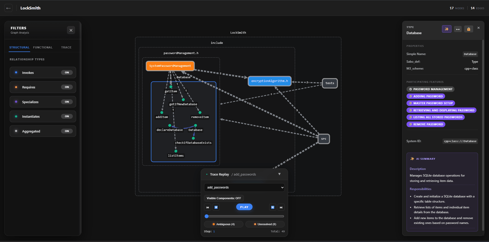
*(Gif: Demonstrating clicking and dragging the Trace Replay panel to the bottom corner of the screen.)*

### Recovered Features
On the left side of the Graph Page, within the **Sidebar Panel**, you can switch to the **FUNCTIONAL** tab. This tab populates after you have executed the Functional Decomposition ("Extract Features") from the Project Actions menu.

Here, you can manage and visualize the high-level system functionalities that SaboViz automatically identified from your runtime execution traces:

* **Toggle Feature Visibility:** Click on any feature card to highlight it. Selecting a feature will visually isolate the specific nodes and edges in the architecture graph that actively contribute to that feature during execution. An active checkmark (✓) indicates the feature is currently toggled on.
* **Feature Categories:** SaboViz visually distinguishes the roles of your clustered entities. Standard business-logic features are represented by a puzzle piece icon (🧩), while global infrastructure or utility modules are represented by a gear icon (⚙️).
* **Decomposition Scores:** Next to the feature name, a mathematical score is displayed. This score reflects the clustering algorithm's calculations based on how highly coupled the underlying components are.
* **AI Descriptions (✨):** If you enabled the "Use AI for Feature Naming" configuration during the extraction process, each feature card will include a dedicated summary box marked with a ✨ icon. This provides a human-readable, context-aware explanation of the module's real-world purpose within the broader system.

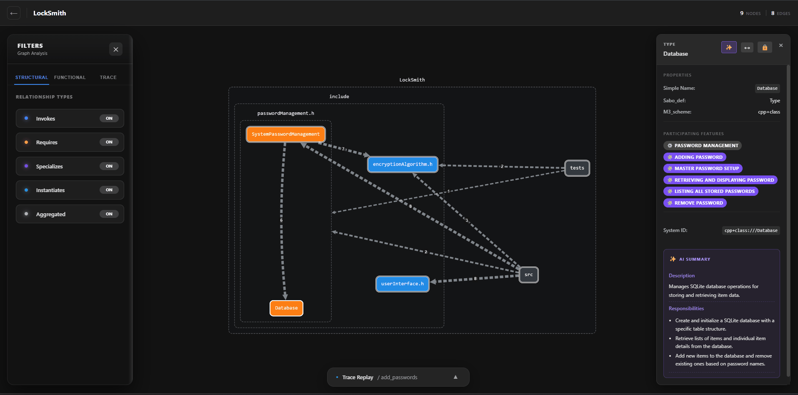
*(Gif: Demonstrating how clicking a recovered feature card isolates the participating nodes on the architecture graph and displays its AI summary.)*

### Execution Trace Analysis (The TRACE Tab)
On the left side of the Graph Page, within the **Sidebar Panel**, you can switch to the **TRACE** tab. This tab populates after you run **Trace Decomposition** from the Project Actions menu.

The Trace tab helps you understand the chronological flow of a specific execution trace by breaking down thousands of raw operations into a readable hierarchy of logical phases.

#### Trace Flow (Macro and Micro-Features)
The top section of the Trace tab displays the **Trace Flow** timeline, which organizes the execution sequence into two levels of abstraction:

* **The Hierarchical Flow:** These top-level segments represent large, coherent chapters of execution (e.g., a complete "User Authentication" phase). They are created by grouping structurally similar micro-features together. **Double-clicking** a segment in the hierarchical flow expands it to reveal its underlying children (the micro-features).
* **The Micro-Feature Flow:** These are the granular, sequential building blocks that make up a hierarchical phase. They represent distinct, short-lived tasks within the trace (e.g., "Validating Password Hash"). 

**Clicking** on any segment in the flow (either a hierarchical macro-phase or a micro-feature) will instantly isolate it and reveal additional contextual information:

* **AI Naming & Summary (✨):** If enabled during the trace decomposition, clicking a segment displays its AI-generated human-readable name and a descriptive summary explaining the specific goal of that system phase.
* **Highlighting Steps:** Selecting a segment will automatically scroll and highlight the associated raw operations in the **Steps List** below.
* **Highlight Cluster Component Button:** When a segment is selected, you can click the "Highlight Cluster Components" button. This action visually isolates the specific static architectural components (nodes and edges) on the main graph canvas that are involved in this exact execution segment, dimming the rest of the architecture.

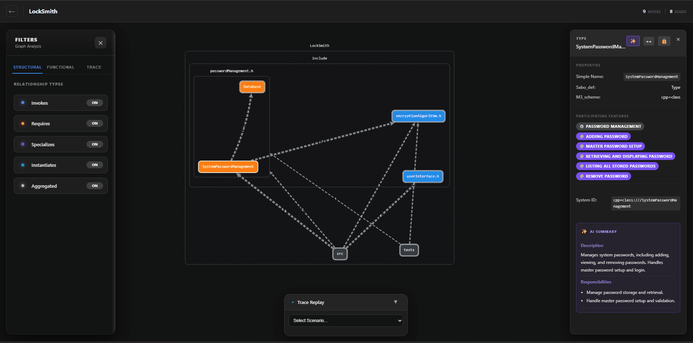
*(Gif: Demonstrating double-clicking a hierarchical segment to expand it, clicking a micro-feature to view its AI summary, and pressing the Highlight Cluster Components button to isolate nodes on the graph.)*

#### The Steps List
Below the Trace Flow visualization is the **Steps List**, a chronological ledger of every single operation (function calls, returns, etc.) that occurred during the execution.

* **Visual Mapping:** When you click a segment in the Trace Flow timeline, SaboViz automatically scrolls to and highlights the corresponding raw execution steps in this list. This allows you to instantly jump from a high-level feature concept down directly to the specific code functions that were executed.
* **Playback Sync:** As you animate the graph using the Trace Replay panel, the Steps List automatically tracks the execution, keeping the currently active step highlighted and in view.