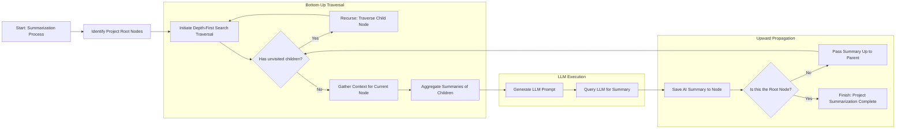
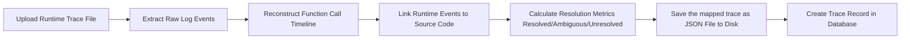
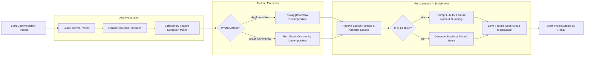
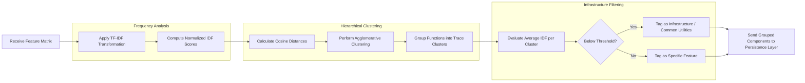

# Execution Flow Documentation

This document explains the execution flow of each major analysis component in SaboViz.

## Setup

Use one of the options below to view the flows:

1. GitHub/GitLab Markdown view:
   - Open this file and scroll to the component section you want.
   - Mermaid blocks should render directly in modern Markdown viewers.
2. VS Code:
   - Open this file and use the Markdown Preview.
   - Open any `.mmd` file in `execution-flow/Mermaid/` for the raw diagram source.

## Components

Click a component to jump to its full flow and node-by-node explanation.

- [Static Extractor](#static-extractor)
- [Ontology Builder](#ontology-builder)
- [Hierarchical AI Summarizer](#hierarchical-ai-summarizer)
- [Dynamic Extractor](#dynamic-extractor)
- [Functional Decomposition](#functional-decomposition)
- [Trace Decomposition](#trace-decomposition)
- [Agglomerative](#agglomerative)
- [Graph Community](#graph-community)

## Static Extractor

Source diagram: [Mermaid/StaticExtractor.mmd](Mermaid/StaticExtractor.mmd)

```mermaid
graph LR
    A[Backend: Trigger Analysis] --> B[Launch Rascal Docker Container]
    B --> C[Load Rascal Configuration]
    C --> D[Scan for the external dependencies]
    D --> E[Find all C and C++ Files]
    E --> F{Iterate over Source Files}
    F --> |For each file| G[Parse & Extract M3 Model for the file]
    G --> H[Filter System Library Entities]
    H --> I{More files?}
    I -->|Yes| F
    I -->|No| J[Compose Models into Single M3 Model]
    J --> K[Save Composed M3 as JSON]
    J --> L[Save Method Snippets as JSON]
    K --> M[Backend Retrieves JSON Files]
    L --> M
    M --> N[Pass to Ontology Builder]
```

| Node | What it does |
| --- | --- |
| Backend: Trigger Analysis | Backend starts the static analysis pipeline for a project. |
| Launch Rascal Docker Container | Starts the Rascal container that performs source parsing. |
| Load Rascal Configuration | Loads Rascal parser settings and path configuration. |
| Scan for the external dependencies | Resolves external include and dependency directories. |
| Find all C and C++ Files | Discovers all C/C++ source files to analyze. |
| Iterate over Source Files | Controls per-file iteration. |
| Parse & Extract M3 Model for the file | Parses one file and extracts its M3 model fragment. |
| Filter System Library Entities | Removes or filters irrelevant system/library entities. |
| More files? | Checks whether there are remaining files. |
| Compose Models into Single M3 Model | Merges per-file models into one composed M3 representation. |
| Save Composed M3 as JSON | Writes the composed M3 model to JSON. |
| Save Method Snippets as JSON | Writes extracted method snippets to JSON. |
| Backend Retrieves JSON Files | Backend loads produced JSON artifacts from storage. |
| Pass to Ontology Builder | Sends static artifacts to the ontology-building stage. |

## Ontology Builder

Source diagram: [Mermaid/OntologyBuilder.mmd](Mermaid/OntologyBuilder.mmd)

```mermaid
graph LR
    A[Receive Composed M3 Model JSON] --> B[Initialize Knowledge Graph with Root Project Node]

    B --> D

    subgraph DevelopmentLayer [Construct Development Layer]
        D[Parse File Paths to generate Folder and File Nodes] --> E[Establish 'contains' and 'includes' Directory Edges]
    end

    E --> G

    subgraph FunctionalLayer [Construct Functional Layer]
        G[Map M3 Declarations to SABO 2.0 Types: Scope, Type, Operation, Variable] --> H[Establish 'declares' Edges from Files to Functional Nodes]
    end

    H --> J

    subgraph RelationalLayer [Construct Relational Layer]
        J[Map M3 Dependencies to SABO 2.0 Edges: invokes, encloses, uses, returns, etc.]
    end

    J --> L

    subgraph OptimizationLayer [Optimize Graph Hierarchy]
        L[Merge and Collapse Single-Child Folders]
    end

    L --> N

    subgraph EnrichmentLayer [Enrich Graph for Visualization]
        N[Compute Ancestry and Parent-Child Expandability Metrics]
    end

    N --> O[Save Finalized Nodes and Edges to Database]

    O --> P{Summarization Enabled?}
    P -->|Yes| Q[Pass Graph to Hierarchical AI Summarizer]
    P -->|No| R[Mark Project as Ready for Visualization]
```

| Node | What it does |
| --- | --- |
| Receive Composed M3 Model JSON | Receives the composed static model produced by parsing. |
| Initialize Knowledge Graph with Root Project Node | Creates the graph root node for the project. |
| Parse File Paths to generate Folder and File Nodes | Builds folder/file nodes from path structure. |
| Establish 'contains' and 'includes' Directory Edges | Adds structural edges such as contains/includes. |
| Map M3 Declarations to SABO 2.0 Types: Scope, Type, Operation, Variable | Converts declarations into SABO 2.0 semantic node types. |
| Establish 'declares' Edges from Files to Functional Nodes | Connects files to declared functional entities. |
| Map M3 Dependencies to SABO 2.0 Edges: invokes, encloses, uses, returns, etc. | Adds semantic dependency edges (invokes, uses, returns, etc.). |
| Merge and Collapse Single-Child Folders | Compresses trivial folder chains for cleaner hierarchy. |
| Compute Ancestry and Parent-Child Expandability Metrics | Precomputes ancestry and expandability metadata for UI navigation. |
| Save Finalized Nodes and Edges to Database | Persists enriched graph nodes and edges in the database. |
| Summarization Enabled? | Decision gate for optional AI summarization. |
| Pass Graph to Hierarchical AI Summarizer | Sends graph to hierarchical summarizer when enabled. |
| Mark Project as Ready for Visualization | Marks project analysis complete when summarization is disabled. |

## Hierarchical AI Summarizer

Source diagram: [Mermaid/HierarchicalAISummarizer.mmd](Mermaid/HierarchicalAISummarizer.mmd)

| Node | What it does |
| --- | --- |
| Start: Summarization Process | Starts AI summarization for the already-built project graph. |
| Identify Project Root Nodes | Finds root nodes that define summarization entry points. |
| Initiate Depth-First Search Traversal | Begins DFS traversal to process graph bottom-up. |
| Has unvisited children? | Checks if deeper child nodes still need processing. |
| Recurse: Traverse Child Node | Recursively descends into child nodes first. |
| Gather Context for Current Node | Collects current-node metadata and context. |
| Aggregate Summaries of Children | Combines child summaries into parent-ready context. |
| Generate LLM Prompt | Builds an LLM prompt from gathered context. |
| Query LLM for Summary | Calls the LLM to generate a human-readable summary. |
| Save AI Summary to Node | Stores generated summary on the current node. |
| Is this the Root Node? | Checks if summarization reached the root. |
| Pass Summary Up to Parent | Propagates summary upward for higher-level aggregation. |
| Finish: Project Summarization Complete | Ends once root-level summary is completed. |

## Dynamic Extractor

Source diagram: [Mermaid/DynamicExtractor.mmd](Mermaid/DynamicExtractor.mmd)

| Node | What it does |
| --- | --- |
| Upload Runtime Trace File | Accepts uploaded runtime trace/log input. |
| Extract Raw Log Events | Parses raw runtime events from the file. |
| Reconstruct Function Call Timeline | Rebuilds chronological function-call execution order. |
| Link Runtime Events to Source Code | Maps runtime events to static source entities. |
| Calculate Resolution Metrics Resolved/Ambiguous/Unresolved | Computes matching quality metrics (resolved/ambiguous/unresolved). |
| Save the mapped trace as JSON File to Disk | Persists normalized mapped trace as JSON. |
| Create Trace Record in Database | Stores trace metadata/record in the database. |

## Functional Decomposition

Source diagram: [Mermaid/FunctionalDecomposition.mmd](Mermaid/FunctionalDecomposition.mmd)

| Node | What it does |
| --- | --- |
| Start Decomposition Process | Starts functional decomposition workflow. |
| Load Runtime Traces | Loads stored runtime traces for the selected project. |
| Extract Executed Functions | Extracts function-level execution signals from traces. |
| Build Binary Feature Execution Matrix | Builds binary matrix used by decomposition algorithms. |
| Which Method? | Selects decomposition strategy. |
| Run Agglomerative Decomposition | Runs agglomerative clustering-based decomposition. |
| Run Graph Community Decomposition | Runs graph-community-based decomposition. |
| Resolve Logical Parents & Ancestor Scopes | Reconciles resulting groups with graph ancestry and parent scopes. |
| Is AI Enabled? | Checks whether AI naming/summarization is enabled. |
| Prompt LLM for Feature Name & Summary | Uses LLM to generate feature name and summary text. |
| Generate Statistical Default Name | Falls back to statistical/default naming. |
| Save Feature Node Group to Database | Persists final feature groups in database. |
| Mark Project Status as Ready | Marks project ready after decomposition completes. |

## Trace Decomposition

Source diagram: [Mermaid/TraceDecomposition.mmd](Mermaid/TraceDecomposition.mmd)

```mermaid
graph LR
    A[decompose_trace: Start] --> B[Preprocess Trace]

    subgraph Preprocessing [Trace Preprocessing]
        B --> C[Keep only Action nodes]
        C --> D[Keep only resolved operations]
        D --> E[Attach source and target summaries]
        E --> F[Sort by step number]
    end

    F --> J

    subgraph EmbeddingAndSegmentation [Embedding and Segmentation]
        J[Build step base vectors]
        J --> K[Apply context window averaging]
        K --> L[Store per-step embedding]
        L --> M[Run PELT change-point detection]
        M --> N[Create micro-features]
    end

    subgraph SegmentEnrichment [Micro-Segment Enrichment]
        N --> O[Collect segment components]
        O --> P[Generate micro-feature name and description]
        P --> T[Build enriched micro-feature]
    end

    subgraph HierarchicalMerging [Adjacent Hierarchical Clustering]
        T --> U[Initialize one cluster per micro-feature]
        U --> V[Compute average linkage for adjacent pairs]
        V --> W{Best distance <= threshold?}
        W -->|Yes| X[Merge best adjacent pair]
        X --> Y[Generate merged cluster name and description]
        Y --> U
        W -->|No| AB[Stop merging]
    end

    AB --> AC[Serialize hierarchical cluster tree]
    AC --> AD[Return micro-features and hierarchical clusters]
```

| Node | What it does |
| --- | --- |
| decompose_trace: Start | Entry point for trace decomposition of one runtime trace. |
| Preprocess Trace | Filters and normalizes trace steps before segmentation. |
| Keep only Action nodes | Removes non-action runtime events. |
| Keep only resolved operations | Drops unresolved/ambiguous events from decomposition input. |
| Attach source and target summaries | Enriches each step with operation summaries from the graph store. |
| Sort by step number | Ensures chronological order before vectorization. |
| Build step base vectors | Builds numeric plus lexical hashed features for each step. |
| Apply context window averaging | Adds local neighborhood context to each step vector. |
| Store per-step embedding | Persists final embedding on each step. |
| Run PELT change-point detection | Detects boundaries in the step-embedding sequence. |
| Create micro-features | Splits embedded steps into micro-feature candidates. |
| Collect segment components | Extracts unique source/target operation IDs per segment. |
| Generate micro-feature name and description | Produces name and description for each segment using available enrichment logic. |
| Build enriched micro-feature | Produces final micro-feature with metadata and steps. |
| Initialize one cluster per micro-feature | Starts hierarchical clustering from single-segment clusters. |
| Compute average linkage for adjacent pairs | Calculates average pairwise cosine distance between neighboring clusters. |
| Best distance <= threshold? | Stops or continues merging based on adjacency threshold. |
| Merge best adjacent pair | Merges the closest neighboring clusters. |
| Generate merged cluster name and description | Produces merged cluster name and description using available enrichment logic. |
| Stop merging | Ends iterative merging when no adjacent pair passes threshold. |
| Serialize hierarchical cluster tree | Converts nested cluster objects to API response structure. |
| Return micro-features and hierarchical clusters | Returns final decomposition payload for persistence and UI. |

## Agglomerative

Source diagram: [Mermaid/Agglomerative.mmd](Mermaid/Agglomerative.mmd)

| Node | What it does | Why it is useful |
| --- | --- | --- |
| Receive Feature Matrix | Receives execution feature matrix. | It gives a single, structured input that all later steps can use consistently. |
| Apply TF-IDF Transformation | Applies TF-IDF weighting to emphasize discriminative functions. | It reduces noise from always-called utility code and makes real feature signals stand out. |
| Compute Normalized IDF Scores | Normalizes IDF-based importance values. | It keeps scores on a comparable scale, which improves stable thresholding across projects. |
| Calculate Cosine Distances | Computes cosine distance between function profiles. | It groups functions by behavioral similarity pattern, not raw call count magnitude. |
| Perform Agglomerative Clustering | Performs hierarchical agglomerative clustering. | It can discover a natural number of groups via distance threshold instead of forcing a fixed cluster count. |
| Group Functions into Trace Clusters | Forms function groups from clustering result. | It turns numeric labels into explicit candidate components usable by the rest of the pipeline. |
| Evaluate Average IDF per Cluster | Calculates average IDF per cluster for specificity scoring. | It provides a simple quality signal to distinguish common utility groups from feature-focused groups. |
| Below Threshold? | Decision gate for infrastructure vs feature cluster. | It makes the infrastructure/feature split explicit and repeatable. |
| Tag as Infrastructure / Common Utilities | Labels low-specificity clusters as infrastructure/common utility. | It avoids over-attributing shared technical code to product features. |
| Tag as Specific Feature | Labels high-specificity clusters as feature-specific. | It keeps groups with strong distinguishing behavior as feature candidates for analysis and naming. |
| Send Grouped Components to Persistence Layer | Sends categorized groups to persistence layer. | It makes decomposition results available to UI visualization and downstream summarization. |

## Graph Community

Source diagram: [Mermaid/GraphCommunity.mmd](Mermaid/GraphCommunity.mmd)

```mermaid
graph LR
    A[Receive Feature Matrix] --> B

    subgraph GraphConstruction [Graph Construction]
        B[Calculate Jaccard Co-execution Weights] --> C[Build Weighted Co-execution Network]
    end

    C --> D

    subgraph CommunityDetection [Community Detection]
        D[Run Leiden Algorithm] --> E[Identify Dense Functional Partitions]
    end

    E --> F

    subgraph NetworkMetrics [Network Metrics Analysis]
        F[Compute Association Scores] --> G[Compute Participation Coefficients]
    end

    G --> H

    subgraph InfrastructureIsolation [Infrastructure Isolation]
        H[Combine Frequency, Participation & Specificity] --> I[Calculate Dynamic Otsu Threshold]
        I --> J[Isolate Cross-Cutting Infrastructure Nodes]
    end

    J --> K

    subgraph FeatureAssignment [Feature Assignment]
        K[Assign Remaining Nodes to Primary Community] --> L[Evaluate Overlap Alpha for Shared Nodes]
        L --> M[Form Final Overlapping Feature Groups]
    end

    M --> N[Send Features and Infrastructure to Persistence Layer]
```

| Node | What it does | Why it is useful |
| --- | --- | --- |
| Receive Feature Matrix | Receives execution feature matrix. | It provides objective co-execution data for graph construction and partitioning. |
| Calculate Jaccard Co-execution Weights | Computes Jaccard similarity/weight for co-executed functions. | It measures shared behavior fairly even when functions have different overall frequencies. |
| Build Weighted Co-execution Network | Builds weighted network from co-execution relations. | It converts trace data into a structure where community algorithms can extract feature-like groups. |
| Run Leiden Algorithm | Runs Leiden community detection on the network. | It finds high-quality dense communities that often align with functional subsystems. |
| Identify Dense Functional Partitions | Extracts dense functional communities. | It yields initial feature candidates quickly from graph topology. |
| Compute Association Scores | Computes association strength metrics. | It enables confident primary assignment and informed overlap decisions per node. |
| Compute Participation Coefficients | Computes participation coefficients across communities. | It helps detect bridge nodes that are likely shared infrastructure. |
| Combine Frequency, Participation & Specificity | Combines frequency and topology metrics for infra scoring. | It produces a more robust infrastructure signal than relying on one metric alone. |
| Calculate Dynamic Otsu Threshold | Derives adaptive threshold (Otsu) for separation. | It adapts automatically to each project's score distribution and reduces manual tuning. |
| Isolate Cross-Cutting Infrastructure Nodes | Isolates cross-cutting/infrastructure nodes. | It improves feature purity by removing utility code before final grouping. |
| Assign Remaining Nodes to Primary Community | Assigns remaining nodes to primary feature communities. | It guarantees clear ownership so each node is represented in a main feature group. |
| Evaluate Overlap Alpha for Shared Nodes | Evaluates overlap rule (alpha) for shared nodes. | It preserves legitimate shared functionality instead of forcing unrealistic single-membership. |
| Form Final Overlapping Feature Groups | Produces final overlapping feature groups. | It better matches real software architecture, where components can support multiple features. |
| Send Features and Infrastructure to Persistence Layer | Sends final feature and infrastructure sets to persistence layer. | It makes results reusable in visualization, naming, and subsequent analysis stages. |
