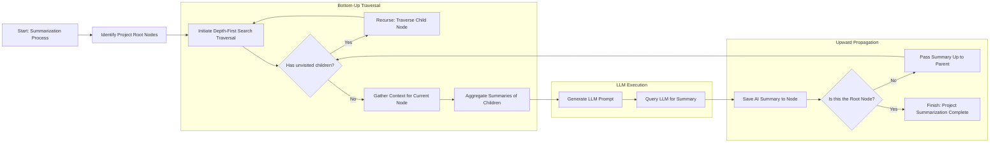
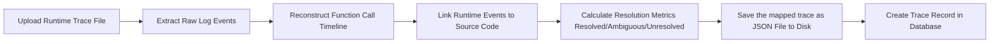
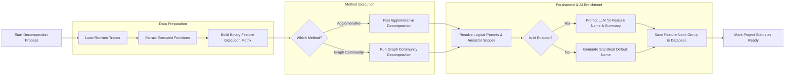
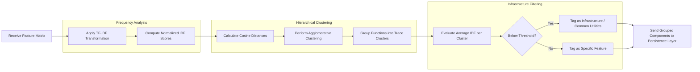

# Execution Flow Documentation

This document explains the execution flow of each major analysis component in SaboViz.

## Setup

Use one of the options below to view the flows:

1. GitHub/GitLab Markdown view:
   - Open this file and scroll to the component section you want.
   - Mermaid blocks should render directly in modern Markdown viewers.
2. VS Code:
   - Open this file and use the Markdown Preview.
   - Open any `.mmd` file in `execution-flow/Mermaid/` for the raw diagram source.

## Components

Click a component to jump to its full flow and node-by-node explanation.

- [Static Extractor](#static-extractor)
- [Ontology Builder](#ontology-builder)
- [Hierarchical AI Summarizer](#hierarchical-ai-summarizer)
- [Dynamic Extractor](#dynamic-extractor)
- [Functional Decomposition](#functional-decomposition)
- [Agglomerative](#agglomerative)
- [Graph Community](#graph-community)

## Static Extractor

Source diagram: [Mermaid/StaticExtractor.mmd](Mermaid/StaticExtractor.mmd)

```mermaid
graph LR
    A[Backend: Trigger Analysis] --> B[Launch Rascal Docker Container]
    B --> C[Load Rascal Configuration]
    C --> D[Scan for the external dependencies]
    D --> E[Find all C and C++ Files]
    E --> F{Iterate over Source Files}
    F --> |For each file| G[Parse & Extract M3 Model for the file]
    G --> H[Filter System Library Entities]
    H --> I{More files?}
    I -->|Yes| F
    I -->|No| J[Compose Models into Single M3 Model]
    J --> K[Save Composed M3 as JSON]
    J --> L[Save Method Snippets as JSON]
    K --> M[Backend Retrieves JSON Files]
    L --> M
    M --> N[Pass to Ontology Builder]
```

| Node | What it does |
| --- | --- |
| A | Backend starts the static analysis pipeline for a project. |
| B | Starts the Rascal container that performs source parsing. |
| C | Loads Rascal parser settings and path configuration. |
| D | Resolves external include and dependency directories. |
| E | Discovers all C/C++ source files to analyze. |
| F | Controls per-file iteration. |
| G | Parses one file and extracts its M3 model fragment. |
| H | Removes or filters irrelevant system/library entities. |
| I | Checks whether there are remaining files. |
| J | Merges per-file models into one composed M3 representation. |
| K | Writes the composed M3 model to JSON. |
| L | Writes extracted method snippets to JSON. |
| M | Backend loads produced JSON artifacts from storage. |
| N | Sends static artifacts to the ontology-building stage. |

## Ontology Builder

Source diagram: [Mermaid/OntologyBuilder.mmd](Mermaid/OntologyBuilder.mmd)

```mermaid
graph LR
    A[Receive Composed M3 Model JSON] --> B[Initialize Knowledge Graph with Root Project Node]

    B --> D

    subgraph DevelopmentLayer [Construct Development Layer]
        D[Parse File Paths to generate Folder and File Nodes] --> E[Establish 'contains' and 'includes' Directory Edges]
    end

    E --> G

    subgraph FunctionalLayer [Construct Functional Layer]
        G[Map M3 Declarations to SABO 2.0 Types: Scope, Type, Operation, Variable] --> H[Establish 'declares' Edges from Files to Functional Nodes]
    end

    H --> J

    subgraph RelationalLayer [Construct Relational Layer]
        J[Map M3 Dependencies to SABO 2.0 Edges: invokes, encloses, uses, returns, etc.]
    end

    J --> L

    subgraph OptimizationLayer [Optimize Graph Hierarchy]
        L[Merge and Collapse Single-Child Folders]
    end

    L --> N

    subgraph EnrichmentLayer [Enrich Graph for Visualization]
        N[Compute Ancestry and Parent-Child Expandability Metrics]
    end

    N --> O[Save Finalized Nodes and Edges to Database]

    O --> P{Summarization Enabled?}
    P -->|Yes| Q[Pass Graph to Hierarchical AI Summarizer]
    P -->|No| R[Mark Project as Ready for Visualization]
```

| Node | What it does |
| --- | --- |
| A | Receives the composed static model produced by parsing. |
| B | Creates the graph root node for the project. |
| D | Builds folder/file nodes from path structure. |
| E | Adds structural edges such as contains/includes. |
| G | Converts declarations into SABO 2.0 semantic node types. |
| H | Connects files to declared functional entities. |
| J | Adds semantic dependency edges (invokes, uses, returns, etc.). |
| L | Compresses trivial folder chains for cleaner hierarchy. |
| N | Precomputes ancestry and expandability metadata for UI navigation. |
| O | Persists enriched graph nodes and edges in the database. |
| P | Decision gate for optional AI summarization. |
| Q | Sends graph to hierarchical summarizer when enabled. |
| R | Marks project analysis complete when summarization is disabled. |

## Hierarchical AI Summarizer

Source diagram: [Mermaid/HierarchicalAISummarizer.mmd](Mermaid/HierarchicalAISummarizer.mmd)

| Node | What it does |
| --- | --- |
| A | Starts AI summarization for the already-built project graph. |
| B | Finds root nodes that define summarization entry points. |
| C | Begins DFS traversal to process graph bottom-up. |
| D | Checks if deeper child nodes still need processing. |
| E | Recursively descends into child nodes first. |
| F | Collects current-node metadata and context. |
| G | Combines child summaries into parent-ready context. |
| H | Builds an LLM prompt from gathered context. |
| I | Calls the LLM to generate a human-readable summary. |
| J | Stores generated summary on the current node. |
| K | Checks if summarization reached the root. |
| L | Propagates summary upward for higher-level aggregation. |
| M | Ends once root-level summary is completed. |

## Dynamic Extractor

Source diagram: [Mermaid/DynamicExtractor.mmd](Mermaid/DynamicExtractor.mmd)

| Node | What it does |
| --- | --- |
| A | Accepts uploaded runtime trace/log input. |
| B | Parses raw runtime events from the file. |
| C | Rebuilds chronological function-call execution order. |
| D | Maps runtime events to static source entities. |
| E | Computes matching quality metrics (resolved/ambiguous/unresolved). |
| F | Persists normalized mapped trace as JSON. |
| G | Stores trace metadata/record in the database. |

## Functional Decomposition

Source diagram: [Mermaid/FunctionalDecomposition.mmd](Mermaid/FunctionalDecomposition.mmd)

| Node | What it does |
| --- | --- |
| A | Starts functional decomposition workflow. |
| B | Loads stored runtime traces for the selected project. |
| C | Extracts function-level execution signals from traces. |
| D | Builds binary matrix used by decomposition algorithms. |
| E | Selects decomposition strategy. |
| F | Runs agglomerative clustering-based decomposition. |
| G | Runs graph-community-based decomposition. |
| H | Reconciles resulting groups with graph ancestry and parent scopes. |
| I | Checks whether AI naming/summarization is enabled. |
| J | Uses LLM to generate feature name and summary text. |
| K | Falls back to statistical/default naming. |
| L | Persists final feature groups in database. |
| M | Marks project ready after decomposition completes. |

## Agglomerative

Source diagram: [Mermaid/Agglomerative.mmd](Mermaid/Agglomerative.mmd)

| Node | What it does |
| --- | --- |
| A | Receives execution feature matrix. |
| B | Applies TF-IDF weighting to emphasize discriminative functions. |
| C | Normalizes IDF-based importance values. |
| D | Computes cosine distance between function profiles. |
| E | Performs hierarchical agglomerative clustering. |
| F | Forms function groups from clustering result. |
| G | Calculates average IDF per cluster for specificity scoring. |
| H | Decision gate for infrastructure vs feature cluster. |
| I | Labels low-specificity clusters as infrastructure/common utility. |
| J | Labels high-specificity clusters as feature-specific. |
| K | Sends categorized groups to persistence layer. |

## Graph Community

Source diagram: [Mermaid/GraphCommunity.mmd](Mermaid/GraphCommunity.mmd)

```mermaid
graph LR
    A[Receive Feature Matrix] --> B

    subgraph GraphConstruction [Graph Construction]
        B[Calculate Jaccard Co-execution Weights] --> C[Build Weighted Co-execution Network]
    end

    C --> D

    subgraph CommunityDetection [Community Detection]
        D[Run Leiden Algorithm] --> E[Identify Dense Functional Partitions]
    end

    E --> F

    subgraph NetworkMetrics [Network Metrics Analysis]
        F[Compute Association Scores] --> G[Compute Participation Coefficients]
    end

    G --> H

    subgraph InfrastructureIsolation [Infrastructure Isolation]
        H[Combine Frequency, Participation & Specificity] --> I[Calculate Dynamic Otsu Threshold]
        I --> J[Isolate Cross-Cutting Infrastructure Nodes]
    end

    J --> K

    subgraph FeatureAssignment [Feature Assignment]
        K[Assign Remaining Nodes to Primary Community] --> L[Evaluate Overlap Alpha for Shared Nodes]
        L --> M[Form Final Overlapping Feature Groups]
    end

    M --> N[Send Features and Infrastructure to Persistence Layer]
```

| Node | What it does |
| --- | --- |
| A | Receives execution feature matrix. |
| B | Computes Jaccard similarity/weight for co-executed functions. |
| C | Builds weighted network from co-execution relations. |
| D | Runs Leiden community detection on the network. |
| E | Extracts dense functional communities. |
| F | Computes association strength metrics. |
| G | Computes participation coefficients across communities. |
| H | Combines frequency and topology metrics for infra scoring. |
| I | Derives adaptive threshold (Otsu) for separation. |
| J | Isolates cross-cutting/infrastructure nodes. |
| K | Assigns remaining nodes to primary feature communities. |
| L | Evaluates overlap rule (alpha) for shared nodes. |
| M | Produces final overlapping feature groups. |
| N | Sends final feature and infrastructure sets to persistence layer. |
